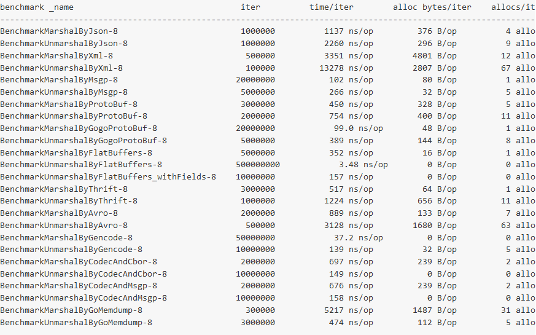

# 序列化框架

序列化是RPC服务框架实现中重要的一环，因为RPC是远程调用，需要数据序列化后传输，接收后再反序列对象。

序列化库也有不同的性能,有些序列化框架会尽量压缩数据和数据类型，有些包含元数据信息，它们的性能表现不尽相同。

对于Go生态圈的序列化框架，有一些开源项目对它们的性能做了对比，比如 [gosercomp](https://github.com/smallnest/gosercomp)做的性能比较：

可以看到XML、JSON相对于其它序列化方式性能挺差的，它们的好处在于通用性。比如rpcx实现了JSON-RPC和JSON-RPC2协议，可以和其它编程语言实现通讯。

关于Java的序列化框架的比较可以参考

