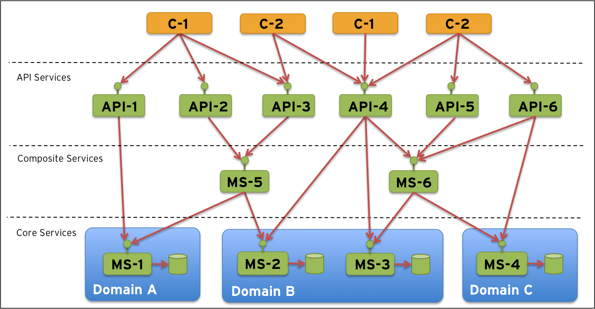

# RPCX 起步

[rpcx]((https://github.com/smallnest/rpcx)是一个分布式的服务框架，致力于提供一个产品级的、高性能、透明化的RPC远程服务调用框架。它参考了目前在国内非常流行的Java生态圈的RPC框架Dubbo、Motan等，为Go生态圈提供一个丰富功能的RPC平台。

随着互联网的发展，网站应用的规模不断扩大，常规的垂直应用架构已无法应对，分布式服务架构以及流动计算架构势在必行，亟需一个治理系统确保架构有条不紊的演进。

目前，随着网站的规模的扩大，一般会将单体程序逐渐演化为微服务的架构方式，这是目前流行的一种架构模式。



即使不是微服务，也会将业务拆分成不同的服务的方式，服务之间互相调用。

那么，如何实现服务\(微服务\)之间的调用的？一般来说最常用的是两种方式: RESTful API和RPC两种服务通讯方式。本书的第一章就介绍了这两种方式的特点和优缺点，那么本书重点介绍的是RPC的方式。

RPCX就是为Go生态圈提供的一个全功能的RPC框架,它参考了国内电商圈流行的RPC框架Dubbo的功能特性，实现了一个高性能的、可容错的，插件式的RPC框架。

RPCX的目标：

1. 简单： 易于学习、易于开发、易于集成和易于发布
2. 高性能：远远高于grpc-go, 更不用说dubbo和motan
3. 服务发现和服务治理：方便开发大规模的微服务集群
4. 跨平台： rpcx 3.0底层不再使用标准rpc库，而是采用跨平台的二进制协议，高效但是方便多语言开发


它的特点包括：

1、指出纯的go方法， 不需要额外的定义
2、可插拔的设计，可以方便扩展服务发现插件、tracing等
3、支持 TCP、HTTP、QUIC、KCP等协议
4、支持多种编码方式， 比如JSON、Protobuf、MessagePack 和 原始字节数据
5、服务发现支持 单机对单机、单机对多机、zookeeper、etcd、consul、mDNS等多种发现方式
6、容错支持 Failover、Failfast、Failtry等多种模式
7、负载均衡支持随机选取、顺序选取、一致性哈希、基于权重的选取、基于网络质量的选取和就近选取等多种均衡方式
8、支持压缩
9、支持扩展信息传递（元数据）
10、支持身份验证
11、支持自动heartbeat和单向请求
12、支持metrics、log、timeout、别名、断路器、TLS等特性

   

本章就让我们举两个的例子，看看如何利用rpcx进行开发。

## 端对端的例子
首先让我们看一个简单的例子，一个服务器和一个客户端。
这并不是一个常用的应用场景，因为部署的规模太小，其实可以直接官方的库或者其它的RPC框架如gRPC、Thrift就可以实现，当然使用rpcx也很简单，我们就以这个例子，先熟悉一下rpcx的开发。

本书中常用的一个例子就是提供一个乘法的服务，客户端提供两个数，服务器计算这两个数的乘积返回。

### 服务器端开发

首先，我们需要实现自己的服务，这很简单，就是定义普通的方法即可:

```go 
type Args struct {
	A int
	B int
}

type Reply struct {
	C int
}

type Arith int

func (t *Arith) Mul(ctx context.Context, args *Args, reply *Reply) error {
	reply.C = args.A * args.B
	return nil
}
```

`Args`作为传入的参数，它的两个字段`A`、`B`代表两个乘数。
`Reply`的`C`代表返回的结果。
`Mul`就是业务方法，对乘数进行相乘，然后返回结果。


然后注册这个服务启动就可以了：
```go 
func main() { 
    s := server.NewServer()
	s.RegisterName("Arith", new(example.Arith), "")
    s.Serve("tcp", *addr)
}
```
三行代码就可以将一个方法暴露成一个服务， 它使用默认的编码和传输方式(TCP)。但是如果你想使用定制的服务器，你可以使用`rpcx.NewServer`生成一个新的服务器对象。


### 客户端同步调用
客户端代码也很简单，首先你需要定义一些访问服务器的一些策略以及服务器的一些信息,然后创建一个`XClient`对象，并且在程序不再使用这个对象的时候关闭它:

```go 
 d := client.NewPeer2PeerDiscovery("tcp@"+*addr, "")
 xclient := client.NewXClient("Arith", client.Failtry, client.RandomSelect, d, client.DefaultOption)
 defer xclient.Close()
```
`NewXClient`第一个参数是服务路径，在Go实现的服务中就是服务端注册的服务名，Java实现的服务器可以是类名全路径。
第二个参数是要调用的方法名。
第三个参数是容错模式，这个使用的是同一个服务器多次重试， 默认重试三次。
第四个参数是在多个服务器同时存在的情况下的负载均衡模式。因为我们这个例子就一个服务器，所以也无所谓随机了，总是选择我们的那一个服务器。
第五个参数是服务器的信息，这里我们使用的是点对点的服务发现模式， 如果是其它的服务模式，比如etcd，那么就要提供etcd的相关信息。
第六个参数可以提供一些额外的信息，比如编码模式、TLS信息等。


客户端所使用的数据结构(只需请求类型和返回类型，不需要服务的定义)和服务端一样。如果客户端和服务器端在一个工程里，所以你可以访问，它们可以共享一套数据结构。但是有些情况下服务方只提供一个说明文档，数据结构还得客户端自己定义：

```go 
type Args struct { A int `msg:"a"` B int `msg:"b"`}

type Reply struct { C int `msg:"c"`}
```

同步调用的代码如下：
```go
args := &example.Args{
		A: 10,
		B: 20,
	}

reply := &example.Reply{}
err := xclient.Call(context.Background(), "Mul", args, reply)
if err != nil {
		log.Fatalf("failed to call: %v", err)
	}

log.Printf("%d * %d = %d", args.A, args.B, reply.C)
```


`Call`调用是一个同步的调用。

输出结果为：
```sh
10 * 20 = 200
```

### 客户端异步调用
客户端异步调用其实是使用`Go`方法，从返回的对象Done字段中可以得到返回的结果信息：

```go 
    reply := &example.Reply{}
	call, err := xclient.Go(context.Background(), "Mul", args, reply, nil)
	if err != nil {
		log.Fatalf("failed to call: %v", err)
	}

	replyCall := <-call.Done
	if replyCall.Error != nil {
		log.Fatalf("failed to call: %v", replyCall.Error)
	} else {
		log.Printf("%d * %d = %d", args.A, args.B, reply.C)
}
```


开发起来是不是超简单？

## 多服务调用

我们再看一个复杂点的例子，这个例子中我们部署了两个相同的服务器，这两个服务注册的名字相同，都是计算两个数的乘积。为了区分客户端调用不同的服务，我们故意为一个服务器的乘积放大了十倍，便于我们观察调用的结果。

数据结构如下:
```go 
type Args struct { A int `msg:"a"` B int `msg:"b"`}

type Reply struct { C int `msg:"c"`}

type Arith1 int

func (t *Arith1) Mul(ctx context.Context, args *Args, reply *Reply) error {
	reply.C = args.A * args.B
	return nil
}

type Arith2 int

func (t *Arith2) Mul(ctx context.Context, args *Args, reply *Reply) error {
	reply.C = args.A * args.B * 10
	return nil
}
```

`Arith2`的Mul方法中我们将计算结果放大了10倍，所以如果传入两个参数10和20,它返回的结果是2000,而`Arith`返回200。

### 服务器端的代码
在服务器端我们启动两个服务器，每个服务器都注册了相同名称的一个服务`Arith`,它们分别监听本地的8972和8973端口:
```go 
func main() { 
    go func() {
        s := server.NewServer()
	    s.RegisterName("Arith", new(Arith1), "")
        s.Serve("tcp", "localhost:8972")
    }()

    go func() {
        s := server.NewServer()
	    s.RegisterName("Arith", new(Arith2), "")
        s.Serve("tcp", "localhost:8973")
    }()

    select{}
}
```

### 客户端代码
因为我们没有使用注册中心，所以这里客户端需要定义这两个服务器的信息，然后定义路由方式是随机选取(RandomSelect)，调用十次看看服务器返回的结果：

```go
type Args struct { A int `msg:"a"` B int `msg:"b"`}

type Reply struct { C int `msg:"c"`}

func main() {
    d := client.NewMultipleServersDiscovery([]*client.KVPair{{Key: "tcp@localhost:8972"}, {Key: "tcp@localhost:8973"}})
	xclient := client.NewXClient("Arith", client.Failtry, client.RandomSelect, d, client.DefaultOption)
	defer xclient.Close()

	args := &example.Args{
		A: 10,
		B: 20,
	}

    for i :=0; i < 10; i++ {
        reply := &example.Reply{}
        err := xclient.Call(context.Background(), "Mul", args, reply)
        if err != nil {
            log.Fatalf("failed to call: %v", err)
        }

        log.Printf("%d * %d = %d", args.A, args.B, reply.C)
        }
	
    }
```


输出结果,可以看到调用基本上随机的分布在两个服务器上。


是不是使用rpcx可以将你的本机方法很方便地转换成服务的调用？ 在后面的章节中，我们还会使用这个例子演示更多的功能。

所以的例子都可以在 https://github.com/rpcx-ecosystem/rpcx-examples3 查看。

